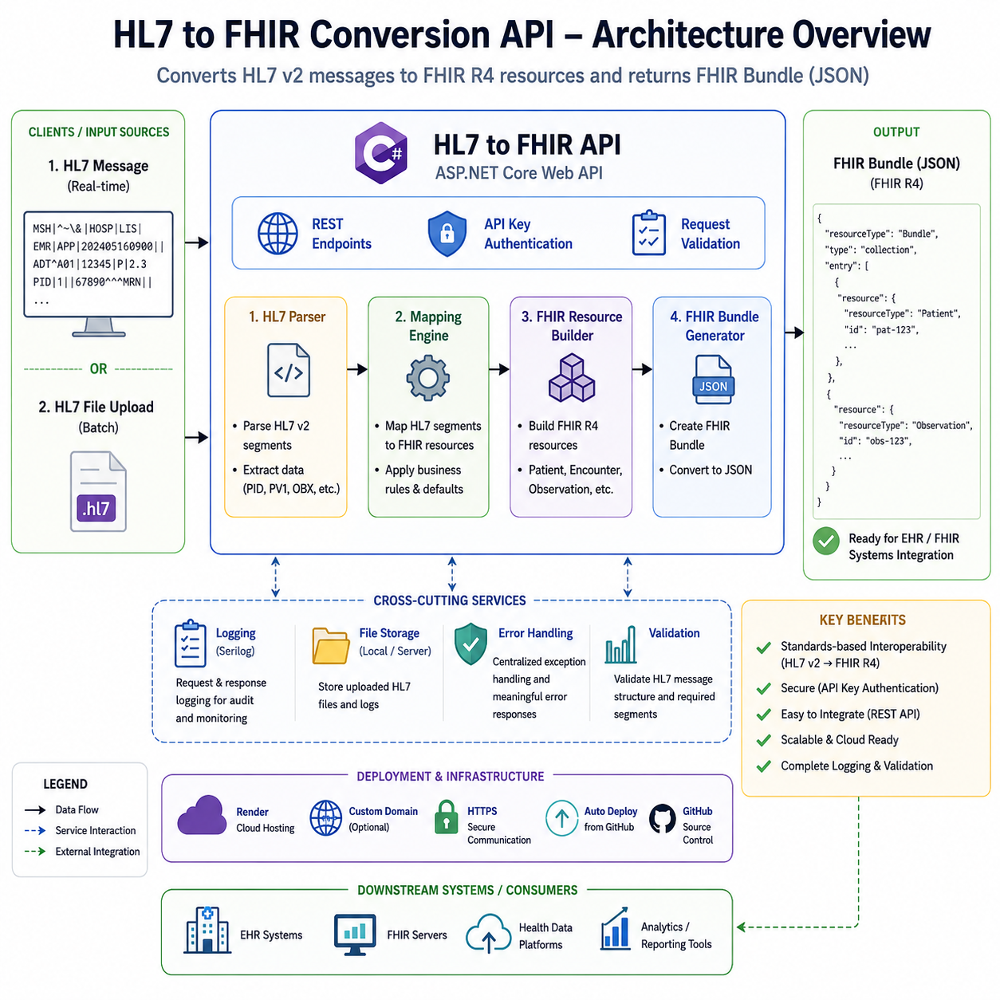

## Table of Contents

- [Overview](#hl7-to-fhir-conversion-api)
- [Why This Project](#why-this-project)
- [Features](#features)
- [Architecture Overview](#architecture-overview)
- [Technologies Used](#technologies-used)
- [Getting Started](#getting-started)
- [Use Cases](#use-cases)
- [Supported HL7 Segments](#supported-hl7-segments)
- [Supported HL7 Message Types](#supported-hl7-message-types)
- [API Endpoints](#api-endpoints)
- [Upload HL7 File](#upload-hl7-file)
- [Sample FHIR Response](#sample-fhir-response)
- [Validation Support](#validation-support)
- [Logging](#logging)
- [Deployment](#deployment)
- [Swagger API Documentation](#swagger-api-documentation)
- [Live Demo](#live-demo)
- [Roadmap](#roadmap)
- [Vision](#vision)
- [Planned Features](#planned-features)
- [Project Goal](#project-goal)
- [Author](#author)

# HL7 to FHIR Conversion API

Healthcare organizations still rely heavily on HL7 v2 messages while modern applications increasingly adopt the FHIR standard. This project bridges that gap by providing a lightweight ASP.NET Core API that parses HL7 v2 messages and converts them into FHIR resources such as Patient, Observation, and Encounter. It is designed for developers, integration engineers, and healthcare interoperability projects.
---
# Why This Project

Many hospitals continue to exchange clinical information using HL7 v2 messages, while modern healthcare applications and APIs increasingly rely on the FHIR standard.

This project simplifies the transition by providing an API that converts HL7 messages into standardized FHIR resources, making integration with modern healthcare platforms easier.

# Features

* HL7 v2 message parsing
* FHIR Bundle generation
* Patient resource mapping
* Observation (OBX) mapping
* Encounter (PV1) mapping
* HL7 file upload support
* Swagger API documentation
* Validation and error handling
* Logging support
* Docker deployment support
* Containerized using Docker and deployable to cloud platforms
  such as Render, Azure App Service, AWS ECS, or Kubernetes.

---

# Architecture Overview



---

# Technologies Used

* ASP.NET Core 10.0
* C#
* HL7 v2.3
* FHIR R4
* Swagger / OpenAPI
* Docker
* Render Cloud Hosting
* GitHub

---
## Getting Started

### Prerequisites

Before running the project, ensure you have the following installed:

* .NET 10 SDK
* Git
* Docker (Optional)

### Clone the Repository

```bash
git clone https://github.com/mohansubramaniank/hl7-to-fhir-api.git
```

### Navigate to the Project

```bash
cd hl7-to-fhir-api
```

### Restore Dependencies

```bash
dotnet restore
```

### Build the Project

```bash
dotnet build
```

### Run the Application

```bash
dotnet run
```

The API will start locally.

### Open Swagger UI

Open your browser and navigate to:

```text
https://localhost:5001/swagger
```

> **Note**
>
> The localhost URL and port may vary depending on your Visual Studio or `launchSettings.json` configuration. After running the application, check the console output for the correct URL.

### Docker (Optional)

Build the Docker image:

```bash
docker build -t hl7-to-fhir-api .
```

Run the container:

```bash
docker run -p 8080:80 hl7-to-fhir-api
```

# Use Cases

- Hospital Information Systems
- Electronic Health Records (EHR)
- Laboratory Information Systems
- Healthcare Integration Engines
- HL7 to FHIR Migration Projects
- Healthcare API Development


# Supported HL7 Segments

| HL7 Segment | FHIR Resource |
| ----------- | ------------- |
| PID         | Patient       |
| OBX         | Observation   |
| PV1         | Encounter     |

---
## Supported HL7 Message Types

Current support:

- ADT^A01
- ADT^A04
- ORU^R01 (planned)

# API Endpoints

## Convert HL7 Message

### POST

```http
/api/hl7/convert
```

### Request

```json
{
  "hl7Message": "MSH|^~\\&|HospitalSystem|MainHospital|FHIRApp|IntegrationEngine|20260430120000||ADT^A01|MSG00001|P|2.3\rPID|1||67890^^^HospitalMRN||Smith^Alice||19920515|F\rPV1|1|I|Ward1^Room12^Bed5||||1234^Johnson^Robert\rOBX|1|NM|GLU^Glucose||105|mg/dL"
}
```

## Upload HL7 File

### POST

```http
/api/hl7/upload
```

Upload:

* `.hl7`
* `.txt`

---

# Sample FHIR Response

```json
{
  "resourceType": "Bundle",
  "type": "collection",
  "entry": [
    {
      "resource": {
        "resourceType": "Patient",
        "id": "67890",
        "name": [
          {
            "family": "Smith",
            "given": [
              "Alice"
            ]
          }
        ],
        "gender": "female",
        "birthDate": "1992-05-15"
      }
    }
  ]
}
```

---

# Validation Support

The API validates:

* Empty HL7 messages
* Missing PID segments
* Invalid OBX structures
* Missing patient identifiers

---

# Logging

Application logging added using ASP.NET Core ILogger.

Tracks:

* HL7 conversion requests
* Validation failures
* Successful FHIR bundle generation

---

# Deployment

Deployed using:

* Docker
* Render Cloud Platform

---
## Roadmap

### Version 1.0

- [x] HL7 Parser
- [x] Patient Mapping
- [x] Observation Mapping
- [x] Encounter Mapping

### Version 1.1

- [ ] Practitioner
- [ ] Organization

### Version 1.2

- [ ] MedicationRequest
- [ ] AllergyIntolerance

### Version 2.0

- [ ] Web Dashboard
- [ ] AI Explanation
- [ ] Mapping Generator
---

# Swagger API Documentation

Swagger UI available at:

```http
/swagger
```
## Live Demo

- **Swagger UI:** https://hl7-to-fhir-api.onrender.com/swagger/index.html
- **Demo Video:** https://drive.google.com/file/d/1WI3mjuLbBj70HYjh1iVMQKmDBV9GCR75/view
  
# Vision

- This project is evolving into an open-source healthcare interoperability toolkit supporting HL7 parsing, FHIR conversion, validation, mapping, and AI-assisted healthcare integration.

# Planned Features

* Practitioner resource mapping
* AllergyIntolerance support
* MedicationRequest mapping
* Authentication & API keys
* Batch HL7 processing
* Azure/AWS deployment
* Database persistence

# Project Goal

This project demonstrates real-world healthcare interoperability workflows between legacy HL7 v2 systems and modern FHIR APIs.

## Skills Demonstrated

- Healthcare Interoperability
- HL7 v2.3
- FHIR R4
- ASP.NET Core 10
- REST API Development
- Swagger/OpenAPI
- Docker
- Cloud Deployment
- JSON Serialization

# License

This project is licensed under the MIT License.

See the LICENSE file for details.

# Author

Mohan Subramanian

Healthcare Integration Engineer

**Expertise**

- HL7 v2
- FHIR R4
- ASP.NET Core
- Healthcare APIs
- System Integration
- RESTful Services

> **Note**
>
> This project is intended as a reference implementation for HL7 v2 to FHIR conversion and can be extended to support additional message types and FHIR resources.

